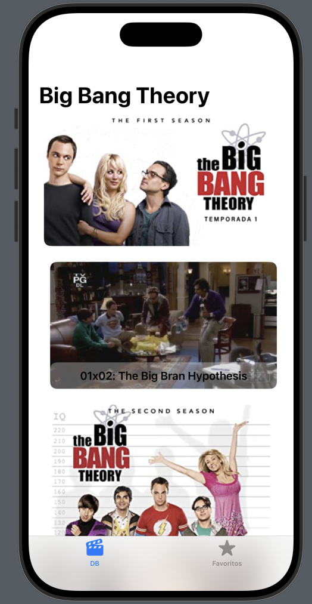
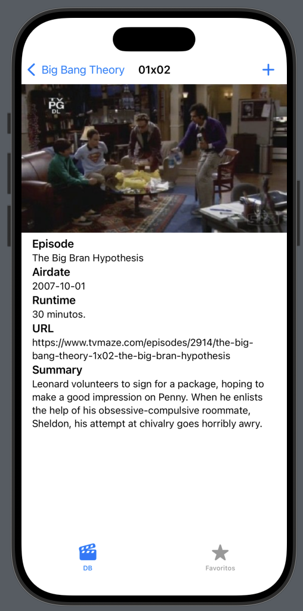

# BigBangTheory App

**BigBangTheory** es una aplicación desarrollada en SwiftUI para la gestión completa de las temporadas y episodios de la serie *The Big Bang Theory*. La aplicación utiliza persistencia local mediante JSON y `Codable` para almacenar y recuperar los datos de manera segura y eficiente.

---

## 📸 Preview

  
  

---

## 📱 Características principales

- **Gestión de temporadas y episodios**:
  - Visualización de todas las temporadas y sus episodios asociados.
  - Navegación fluida entre temporadas y episodios mediante tarjetas interactivas.
  - Persistencia local de todos los datos de temporadas y episodios usando JSON y `Codable`.
  
- **Pantalla de episodios**:
  - Lista de tarjetas para cada episodio de la temporada seleccionada.
  - Al pulsar una tarjeta de episodio, se accede a la **pantalla de detalle** del episodio.
  
- **Pantalla de detalle del episodio**:
  - Botón **Añadir a favoritos** que almacena el episodio en la pestaña de favoritos.
  - Visualización de la información completa del episodio:
    - **Temporada y número de episodio**.
    - **Imagen** representativa del episodio.
    - **Episode**: nombre del episodio.
    - **Airdate**: fecha de emisión original.
    - **Runtime**: duración del episodio.
    - **URL**: enlace a la página oficial del episodio.
    - **Summary**: resumen descriptivo del episodio.
    
- **Favoritos**:
  - Todos los episodios añadidos a favoritos se almacenan de forma persistente.
  - Posibilidad de acceder rápidamente a los episodios favoritos desde la pestaña correspondiente.

---

## ▶️ Flujo de la aplicación

1. **Pantalla principal**:
   - Muestra todas las temporadas con sus episodios en tarjetas.
   - Cada tarjeta contiene información mínima y una imagen representativa.
   - Selección de un episodio abre la **pantalla de detalle**.
   
2. **Pantalla de detalle del episodio**:
   - Muestra toda la información relevante del episodio.
   - Permite añadir el episodio a favoritos mediante un botón.
   - Los datos persisten automáticamente en el JSON local.

3. **Persistencia de datos**:
   - La aplicación carga los datos desde un JSON local al iniciar.
   - Todas las modificaciones y adiciones se guardan usando `Codable`.
   - Garantiza compatibilidad y mantenimiento sencillo de los datos.

---

## 🛠️ Tecnologías y herramientas

- **Lenguaje**: Swift 5+
- **Framework**: SwiftUI
- **Persistencia**: JSON + Codable
- **Componentes clave**:
  - `List` y `ScrollView` para la visualización de temporadas y episodios.
  - `NavigationStack` para la navegación entre pantallas.
  - `Button` para añadir episodios a favoritos.
  - Carga de imágenes mediante `AsyncImage` nativo de SwiftUI.
- **Arquitectura**:
  - Modular, separando la lógica de la vista, lógica de datos y persistencia.
  - Permite fácil escalabilidad para agregar nuevas funcionalidades sin comprometer la estructura.

---

## 📱 Requisitos

- **iOS 17.0 o superior**
- **Xcode 15 o superior**
- **Simulador o dispositivo compatible con SwiftUI**
